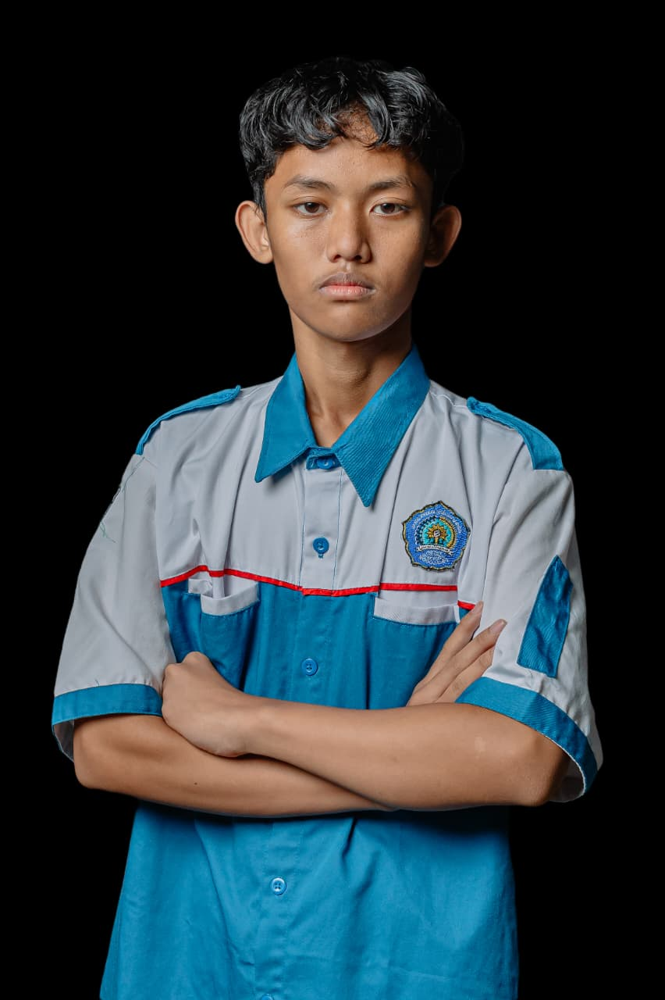
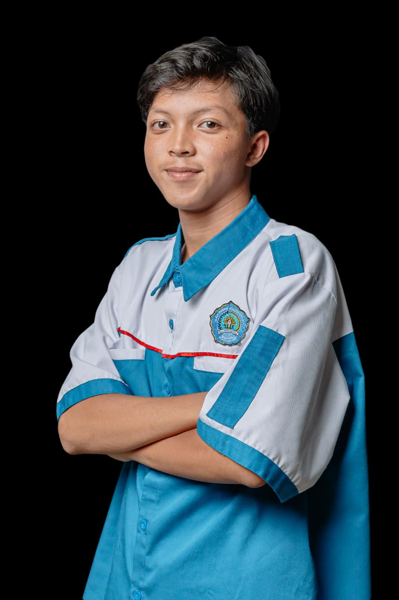
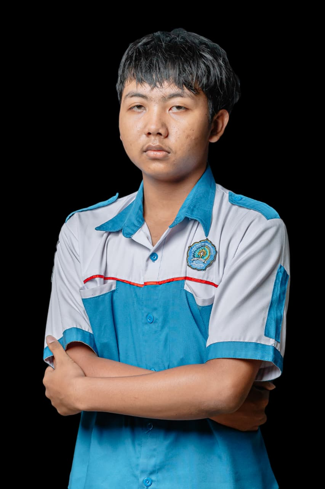
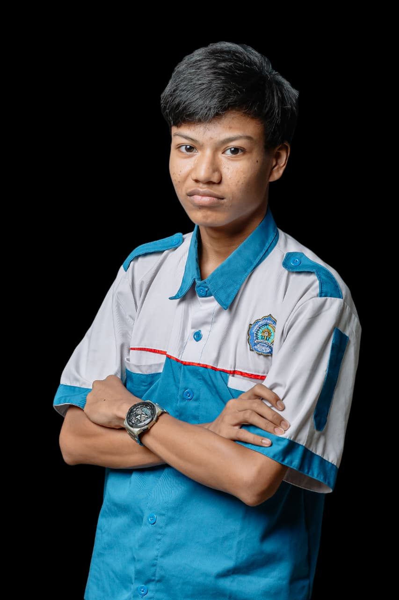

&lt;!-- YFGL Developer – README v2.0 --&gt;
&lt;!-- markdownlint-disable MD033 MD041 --&gt;

&lt;div align="center"&gt;


**Website portofolio tim teknologi SMK Muhammadiyah 6 Rogojampi**  
🎮 Game Development & Visual Design

[](https://github.com/4lyaya)
[](https://github.com/4lyaya)
[](https://github.com/4lyaya/YFGL_Developer/commits)
[](LICENSE)

[🚀 Demo](https://4lyaya.github.io/YFGL_Developer) •
[📬 Kontak](#-kontak) •
[🤝 Kontribusi](#-kontribusi)

&lt;/div&gt;

---

## 📖 Daftar Isi

&lt;!--ts--&gt;

1. [Fitur Utama](#-fitur-utama)
2. [Skema Warna](#-skema-warna)
3. [Anggota Tim](#-anggota-tim)
4. [Teknologi](#-teknologi)
5. [Responsif Design](#-responsif-design)
6. [Visi & Misi](#-visi--misi)
7. [Statistik](#-statistik)
8. [Instalasi](#-instalasi--penggunaan)
9. [Pengembangan](#-pengembangan)
10. [Hosting](#-hosting)
11. [Lisensi](#-lisensi)
12. [Kontribusi](#-kontribusi)
13. [Kontak](#-kontak)
    &lt;!--te--&gt;

---

## 🎯 Fitur Utama

| Fitur                     | Deskripsi                               |
| ------------------------- | --------------------------------------- |
| 🎨 **Desain Modern**      | Minimalis putih-hitam-biru tua          |
| 📱 **Responsif**          | Mobile-first, tablet, desktop           |
| ✨ **Animasi Interaktif** | Typing, 3D tilt card, counter statistik |
| 🐙 **GitHub API**         | Repo anggota otomatis update            |
| ℹ️ **Modal Detail**       | Info lengkap + tech-stack tiap anggota  |
| 🧭 **Navigasi Smooth**    | Scroll halus + back-to-top              |

---

## 🎨 Skema Warna

| Warna     | Kode Hex  | Kegunaan                 |
| --------- | --------- | ------------------------ |
| Putih     | `#ffffff` | Background utama         |
| Hitam     | `#000000` | Teks utama               |
| Biru Tua  | `#1e3a8a` | Aksen, button, highlight |
| Abu-abu   | `#f9fafb` | Background sekunder      |
| Abu-abu-2 | `#e5e7eb` | Border                   |

---

## 👥 Anggota Tim

&lt;details&gt;
&lt;summary&gt;&lt;b&gt;🔸 Aji Putra Pratama (Yazan)&lt;/b&gt; – Fullstack Developer&lt;/summary&gt;

- **GitHub**: [@Yazan969](https://github.com/Yazan969)
- **Tech**: JavaScript, React, Node.js, PHP, MySQL, Tailwind, Next.js
- **Foto**: 

&lt;/details&gt;

&lt;details&gt;
&lt;summary&gt;&lt;b&gt;🔸 Raditya Syarif H. (Fenic)&lt;/b&gt; – Design Artist & Game Programmer&lt;/summary&gt;

- **GitHub**: [@SmileHuman](https://github.com/SmileHuman)
- **Tech**: Unity, C#, Blender, Photoshop, Game Design
- **Foto**: 

&lt;/details&gt;

&lt;details&gt;
&lt;summary&gt;&lt;b&gt;🔸 Rasya Ifqian Nezqi (Gyro)&lt;/b&gt; – Graphic Designer & 3D Digital Artist&lt;/summary&gt;

- **GitHub**: [@ry71kmr54-lgtm](https://github.com/ry71kmr54-lgtm)
- **Tech**: Blender, Maya, Substance Painter, Photoshop, Illustrator
- **Foto**: 

&lt;/details&gt;

&lt;details&gt;
&lt;summary&gt;&lt;b&gt;🔸 Uno Fathir A. R. K. (Liu Kindy)&lt;/b&gt; – Game Designer, Graphic & 3D Artist&lt;/summary&gt;

- **GitHub**: [@Liu-Kindy](https://github.com/Liu-Kindy)
- **Tech**: Game Design, Blender, Unity, Photoshop, Illustrator, Figma
- **Foto**: 

&lt;/details&gt;

---

## 🚀 Teknologi

### Frontend


### Integrasi


---

## 📱 Responsif Design

| Breakpoint | Lebar Layar     | Layout  |
| ---------- | --------------- | ------- |
| Mobile     | `&lt; 640 px`   | 1 kolom |
| Tablet     | `640 – 1024 px` | 2 kolom |
| Desktop    | `&gt; 1024 px`  | 4 kolom |

---

## 🎯 Visi & Misi

### Visi

Menjadi tim _game & visual design_ yang kreatif dan inovatif.

### Misi

- 🎮 Mengembangkan game orisinal
- 🎨 Menciptakan desain visual & 3D memukau
- 📚 Berbagi pengetahuan dan pengalaman
- 🤝 Berkolaborasi dengan komunitas industri kreatif

---

## 📊 Statistik Tim


---

## 🛠 Instalasi & Penggunaan

### 1. Clone Repository

```bash
git clone https://github.com/4lyaya/YFGL_Developer.git
cd YFGL_Developer
```

### 2. Buka di Browser

Buka `index.html`.

### 3. Kustomisasi Data

``` javascript
this.members = [
    {
        name: 'Nama Lengkap',
        role: 'Role',
        username: 'Username',
        bio: 'Deskripsi singkat...',
        github: 'https://github.com/username',
        githubUsername: 'username',
        photo: 'url-foto',
        technologies: ['Tech1', 'Tech2', 'Tech3']
    }
];
```

## 🔧 Pengembangan

### Struktur Folder

    YFGL_Developer/
    ├── index.html
    ├── assets/
    │   ├── images/
    │   ├── css/
    │   └── js/
    └── README.md


## 🌐 Hosting

-   GitHub Pages
-   Netlify
-   Vercel

## 📄 Lisensi

© 2025 CodeCraft Studio Hak cipta dilindungi.

## 🤝 Kontribusi

1.  Fork repo\
2.  Buat branch\
3.  Commit\
4.  Push\
5.  Pull Request

## 📞 Kontak

-   Email: smkmuh6rogojampi
-   Instagram: @smuhero
-   GitHub: 4lyaya

Dibuat oleh **4lyaya**.
